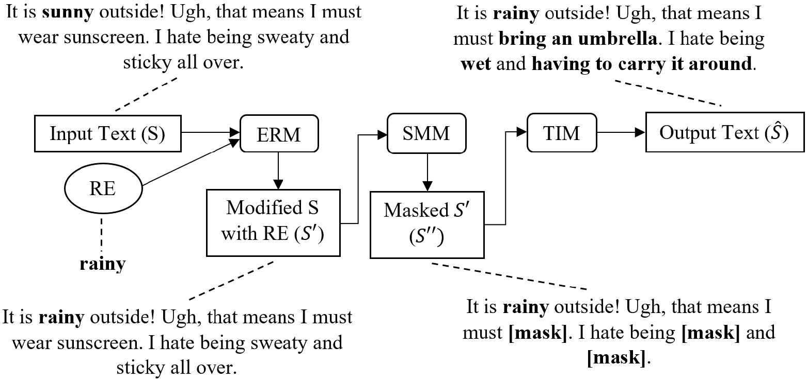

# SMERTI for Semantic Text Exchange
Code for the SMERTI pipeline designed for Semantic Text Exchange, presented in [*Keep Calm and Switch On! Preserving Sentiment and Fluency in Semantic Text Exchange*](https://www.aclweb.org/anthology/D19-1272/) published at EMNLP-IJCNLP 2019. You can cite it as follows:
```
@inproceedings{feng-etal-2019-keep,
    title = "Keep Calm and Switch On! Preserving Sentiment and Fluency in Semantic Text Exchange",
    author = "Feng, Steven Y. and Li, Aaron W. and Hoey, Jesse",
    booktitle = "Proceedings of the 2019 Conference on Empirical Methods in Natural Language Processing and the 9th International Joint Conference on Natural Language Processing (EMNLP-IJCNLP)",
    month = nov, year = "2019", address = "Hong Kong, China",
    publisher = "Association for Computational Linguistics",
    url = "https://www.aclweb.org/anthology/D19-1272",
    doi = "10.18653/v1/D19-1272", pages = "2701--2711",
}
``` 
Poster and other resources can be found [*here*](https://styfeng.github.io/).

Note: inquiries should be directed to [*stevenyfeng@gmail.com*](mailto:stevenyfeng@gmail.com) or by opening an issue here.


Diagram of SMERTI pipeline, with ERM (Entity Replacement Module), SMM (Similarity Masking Module), and TIM (Text Infilling Module). Starting string on top left, ending string on top right, given replacement entity (RE) of *rainy*.

## Datasets can be obtained from the following sources:
1. [*News Headlines*](https://www.kaggle.com/rmisra/news-category-dataset)
2. [*Yelp Reviews*](https://www.yelp.com/dataset)
3. [*Amazon Reviews*](http://jmcauley.ucsd.edu/data/amazon/links.html) (user review data (18gb))

## Following is a brief description of each file:

1. Dataset_preprocessing is for preprocessing the reviews (e.g. Yelp and Amazon) and news headlines, generating training and testing splits, and writing them to .txt files. (Data Preprocessing and Preparation)
2. Dataset_masking is for generating masked versions of the training and testing data from step 1. for reviews and news headlines, and writing them to .txt files. (Data Preprocessing and Preparation)
3. RNN_training and Transformer_training are to train the TIM for SMERTI-RNN and SMERTI-Transformer, respectively, based on the .txt files generated from steps 1. and 2. above. (Text Infilling Module (TIM) Training)
4. RNN_final_pipeline and Transformer_final_pipeline are the final pipelines for SMERTI-RNN and SMERTI-Transformer, respectively. This includes the ERM, SMM, and TIM components of each pipeline variation. Also note that the bottom of each file includes a section to generate and write output to .txt files, based on the evaluation lines generated from step 5. below, to be used in metric calculations in step 6. (Final SMERTI Pipelines)
5. Evaluation_setup is to generate the evaluation lines for the datasets and includes choosing nouns, choosing evaluation lines per noun, and writing them to .txt files. (Evaluation)
6. Final_evaluation is to calculate metrics including SPA, BLEU, CSS, Perplexity, and SLOR using SMERTI's output from the evaluation lines, and includes functions to write results to .txt files. (Evaluation)
7. SLOR_normalization is to normalize all SLOR values calculated from step 6. above to a [0,1] interval. (Evaluation)

## GenAug SMERTI-Transformer
"GenAug SMERTI-Transformer" folder contains the SMERTI training and inference code for GenAug, presented in [*GenAug: Data Augmentation for Finetuning Text Generators*](https://arxiv.org/abs/2010.01794) published at EMNLP 2020 DeeLIO Workshop.
